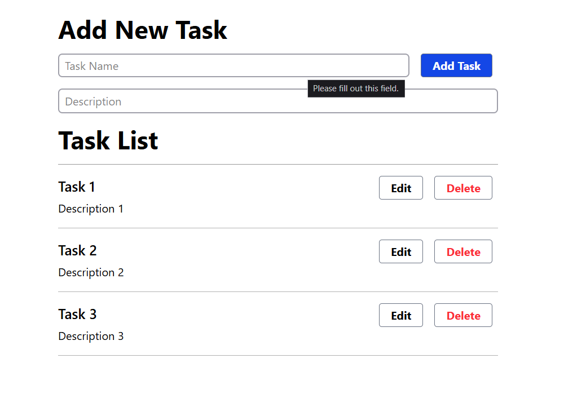
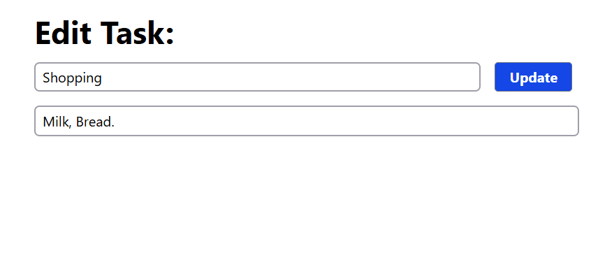
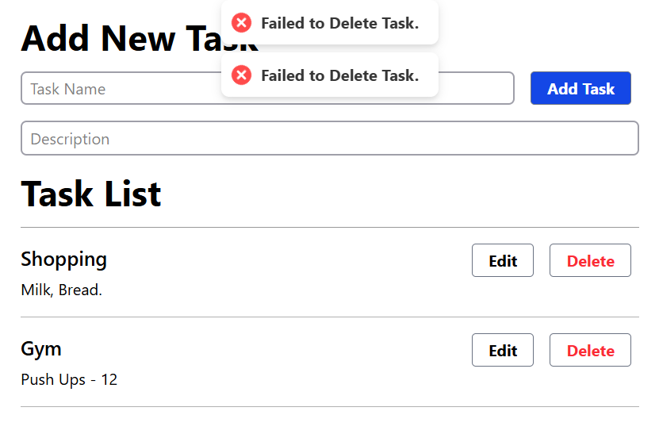
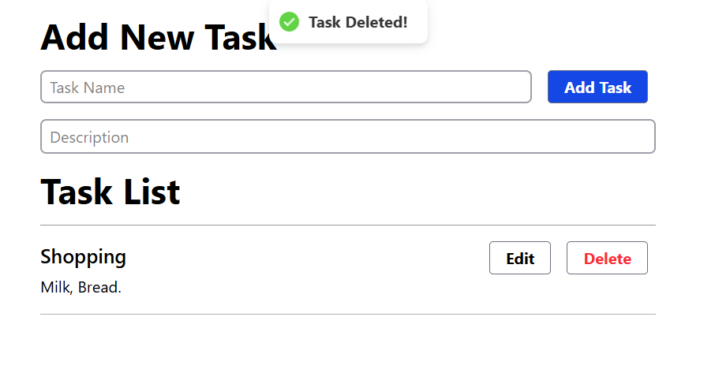

# 📝 Task Management App

A simple Task Management application built with **React (Vite)** for the frontend and **Node.js with Express** for the backend. This app does **not** use a database – tasks are managed using in-memory arrays (and localStorage on frontend for persistence across reloads).

## 🔧 Tech Stack

- **Frontend:** React (with Vite), React Router, Axios, React Hot Toast
- **Backend:** Node.js, Express
- **Utilities:** UUID for unique task IDs
- **Architecture:**
  - Controllers separated in the `backend/controllers` folder
  - Utility methods stored in `backend/utils`
  - No use of views in Express (API only)

---

## 📁 Folder Structure

```
task-app/
├── backend/
│   ├── controllers/
│   │   └── taskController.js
│   ├── utils/
│   │   └── taskData.js
│   └── index.js
├── frontend/
│   ├── public/
│   ├── src/
│   │   ├── components/
│   │   │   └── TaskForm.jsx, TaskList.jsx, TaskCard.jsx
│   │   ├── pages/
│   │   │   └── Home.jsx, EditTask.jsx
│   │   ├── App.jsx
│   │   ├── main.jsx
│   │   └── router.jsx
├── .env
├── README.md
```

---

## ⚙️ Installation & Running the App

### 1️⃣ Clone the Repository

```bash
git clone https://github.com/your-username/task-app.git
cd task-app
```

---

### 2️⃣ Backend Setup (Node + Express)

```bash
cd backend
npm install
```

#### 🔌 Environment Variables

Create a `.env` file in the `backend/` directory:

```
PORT=8080
```

#### ▶️ Run Backend

```bash
node index.js
```

The backend server will run at `http://localhost:8080`

---

### 3️⃣ Frontend Setup (React + Vite)

```bash
cd frontend
npm install
```

#### 🔌 Environment Variables

Create a `.env` file in the `frontend/` directory:

```
VITE_API_URL=http://localhost:8080
```

#### ▶️ Run Frontend

```bash
npm run dev
```

The frontend will run at `http://localhost:5173` (Vite default)

---

## 🚀 Features

- ✅ Add Task (Name & Description)
- ✅ Edit Task
- ✅ Delete Task
- ✅ Show toast messages using [react-hot-toast](https://react-hot-toast.com/)
- ✅ React Router used for routing (e.g., editing a task)
- ✅ UUID used for unique IDs and React keys
- ✅ In-memory storage on backend (no DB)
- ✅ LocalStorage on frontend for task persistence

---

## 🔌 API Endpoints

| Method | Endpoint     | Description    |
| ------ | ------------ | -------------- |
| GET    | `/tasks`     | Get all tasks  |
| POST   | `/tasks`     | Add a new task |
| PUT    | `/tasks/:id` | Update a task  |
| DELETE | `/tasks/:id` | Delete a task  |

---

## 🧱 Internal Architecture

### Backend

- Task logic handled inside `controllers/taskController.js`
- `utils/taskData.js` manages in-memory task storage (array)
- No use of wrapAsync or customError due to local storage simplicity

### Frontend

- All API calls made using **axios** via `VITE_API_URL`
- Tasks stored in **React state** and synced with **localStorage**
- Components structured into:
  - `TaskForm` – for adding/editing tasks
  - `TaskList` – displays all tasks
  - `TaskCard` – displays each individual task with Edit/Delete buttons

---

## 🖼️ Screenshots

| Home Task |     | ------------------------------------------------- |                     | Edit Page|     | ----------------------------- |
                                                 
 
  
|  Handling Failures |     | ------------------------------------------------- |                               | Delete Page|  | ----------------------------- |

 

## 💡 Tips

- Make sure ports match in both `.env` files.
- Use `uuid` when creating new tasks to avoid ID collisions.
- If you restart the backend, data will reset (since it's in-memory).
- You can customize toast messages in the `toast.promise` wrappers for async calls.

---

## 📄 License

MIT – Free to use and modify.

---

## 🙌 Author

Made by Anwar Shaik – feel free to reach out!
